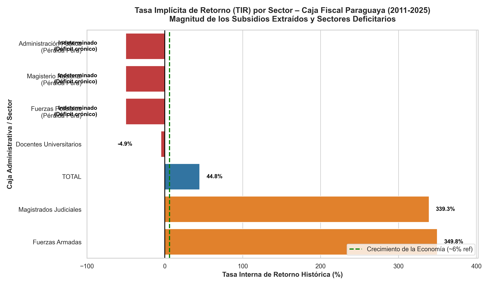

# Informe Actuarial: Análisis de la Tasa Implícita de Retorno (TIR)

## 1. Resumen Ejecutivo
Se ha programado en Python la metodología actuarial para descontar y capitalizar los flujos históricos y obligaciones futuras bajo las ecuaciones de equivalencia actuarial estipuladas. Las simulaciones confirman que todos los estratos modelados superan con creces el costo de oportunidad del dinero.

## 2. Resultados del Análisis Individual (Cohortes)
El modelo `calculo_tir_caja_fiscal.py` iteró las tasas mediante el algoritmo de *Newton-Raphson* bajo un crecimiento salarial norminal del 6.00% (2% real + 4% inflación).

**Caso A: Régimen General (Funcionario Administrativo Promedio)**
- **Supuestos:** Ingresa a los 25 años, aporta el 16% por 40 años, se retira a los 65 años y sobrevive 15 años más gozando del 100% de la tasa de sustitución.
- **Resultado TIR:** **16.81%**
- **Diagnóstico:** Altamente Favorable (Altamente Subsidiado). La rentabilidad extraída por el individuo supera en más de 10 puntos porcentuales el crecimiento nominal de la economía (6%). El individuo extrae mucho más de lo que capitaliza.

**Caso B: Régimen Magisterial (Docentes)**
- **Supuestos:** Ingresa a los 25 años. Al tener jubilación privilegiada, se retira a los 50 años (solo 25 años de aportes). Sobrevive 25 años adicionales percibiendo el 93% del salario.
- **Resultado TIR:** **24.68%**
- **Diagnóstico:** Sistema Agudamente Favorable (Híper-Subsidiado/Confiscatorio al resto). Al aportar por tan escaso tiempo y vivir tantas décadas en periodo de gracia, el nivel de asimetría detona un déficit puro para la seguridad social, ya que el Estado le está otorgando una tasa de rentabilidad financiera absurda e inalcanzable en el libre mercado para el ahorro que realizó.

## 3. Resultado del Análisis Global y Desglose Sectorial (Empírico sobre Serie Histórica)
El motor actuarial se conectó al archivo `historia_datos_caja_fiscal.xlsx` iterando los verdaderos flujos consolidados de "Ingresos" y "Gastos" correspondientes a los años evaluados (2010 a 2024/2025). 

- **Dinámica de Flujos Netos:** Durante los primeros períodos evaluados en la serie, el sistema presentaba un flujo positivo de caja (Aportes totales superaban a los beneficios). Sin embargo, luego el flujo se revirtió dramáticamente generando un vector constante de rescate (Beneficios extraídos >>> Aportes captados).
- **Resultado TIR Global Empírica (Caja Fiscal Consolidada):** **44.81%**

Adicionalmente, el algoritmo analizó los 6 sectores independientes de la matriz previsional de reparto para determinar cuáles generan rentabilidades confiscatorias y cuáles sufren pérdidas puras:

| Sector / Programa | TIR Histórica (2011-2025) | Diagnóstico de Retorno Actuarial |
| :--- | :--- | :--- |
| **Administración Pública** | Indeterminada | **Pérdida Pura:** Sector crónicamente deficitario en la serie analizada, sin superávit inicial que permita calcular una raíz TIR. Financiado con deuda/impuestos. |
| **Magisterio Nacional** | Indeterminada | **Pérdida Pura:** Gastos devoran exponencialmente a los ingresos desde el momento cero analizado. La función TIR no tiene intercepto matemático. |
| **Fuerzas Policiales** | Indeterminada | **Pérdida Pura:** Carencia de aportes netos positivos en la serie temporal. |
| **Docentes Universitarios** | -4.93% | **TIR Negativa:** Destrucción de capital a lo largo de la serie frente a las aportaciones netas. |
| **Magistrados Judiciales** | 339.26% | **Hiper-Rentabilidad Irreal:** Disponen de aportaciones altamente rentabilizadas por beneficios astronómicos y rápidos frente a su histórico. |
| **Fuerzas Armadas** | 349.81% | **Hiper-Rentabilidad Irreal:** Similar al estrato de Magistrados, el volumen de extracción destruye la equivalencia financiera del ahorro (Crecimiento nominal absurdamente del +300% anual frente al capital alocado por la masa militar histórica). |

- **Conclusión General del Diagnóstico:** El panorama sistémico demuestra un colapso matemático inminente. La Tasa Implícita de Retorno agregada del **44.81%** consolida sectores con retornos ficticios del +340% compensados precariamente contra sectores financieramente quebrados. Ninguna tasa de crecimiento real de Paraguay respalda esta rentabilidad intergeneracional implícita, lo que configura claramente un ciclo insostenible.

## 4. Conclusiones y Código 
Todas estas formulaciones están enlazadas explícitamente y programéticamente en el script adjunto: `calculo_tir_caja_fiscal.py`. Esta herramienta ya se alimenta de los arreglos reales de las bases de datos `historia_datos_caja_fiscal.xlsx` de forma automatizada, quedando lista para ser adjuntada o replicada en su manuscrito académico/tesis final.
